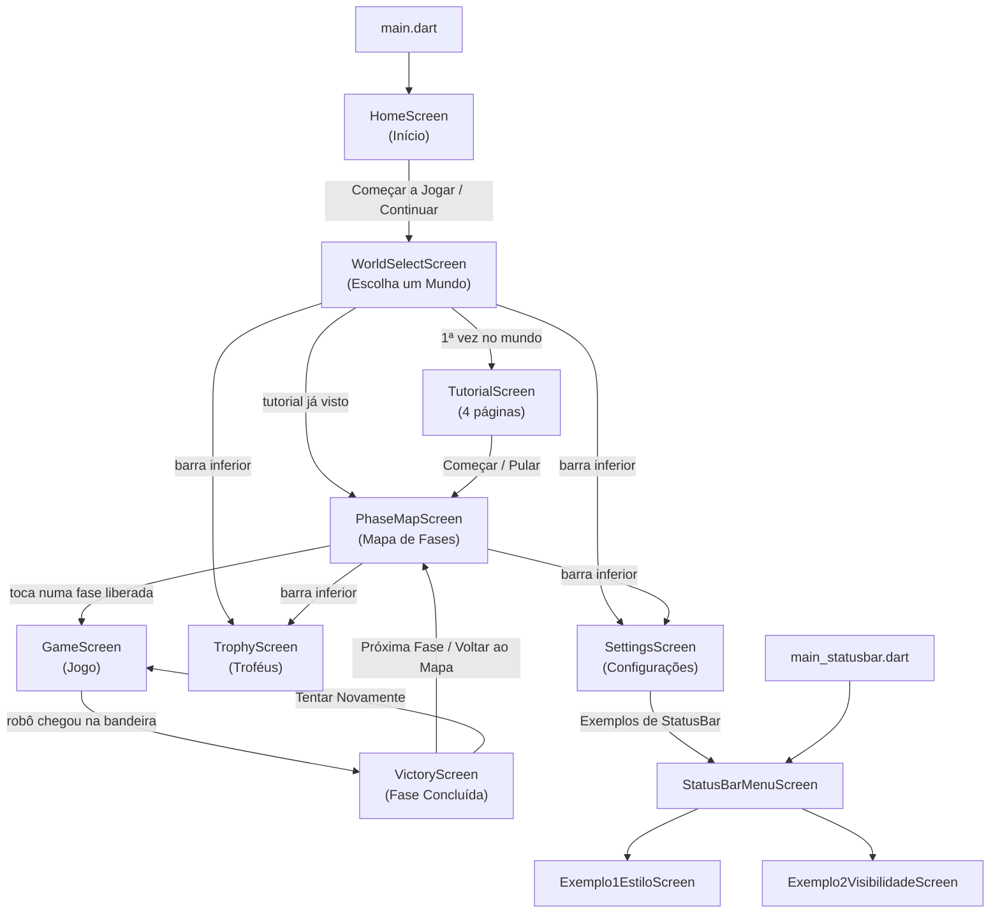

# 📘 Documentação do Código — CodePlay BR

> Guia completo de **todos os arquivos, classes, heranças e lógicas** do app *Aprenda Programação Jogando (CodePlay BR)*.
> Feito para consulta durante a apresentação da **Fase 5 — Implementação das Interfaces do App**.

---

## 📋 Sumário

1. [Visão geral em números](#1-visão-geral-em-números)
2. [Como rodar o projeto](#2-como-rodar-o-projeto)
3. [Estrutura de pastas](#3-estrutura-de-pastas)
4. [Fluxo de navegação entre as telas](#4-fluxo-de-navegação-entre-as-telas)
5. [Conceitos de Dart/Flutter usados no projeto](#5-conceitos-de-dartflutter-usados-no-projeto)
6. [Árvore de herança — todas as classes](#6-árvore-de-herança--todas-as-classes)
7. [Arquivo por arquivo](#7-arquivo-por-arquivo)
8. [Como funciona a lógica do jogo](#8-como-funciona-a-lógica-do-jogo)
9. [Animações usadas](#9-animações-usadas)
10. [Widgets do Flutter usados](#10-widgets-do-flutter-usados)
11. [Testes automatizados](#11-testes-automatizados)
12. [Arquivos de configuração e pastas de plataforma](#12-arquivos-de-configuração-e-pastas-de-plataforma)
13. [Pontos de atenção (limitações conhecidas)](#13-pontos-de-atenção-limitações-conhecidas)
14. [Perguntas prováveis na apresentação](#14-perguntas-prováveis-na-apresentação)

---

## 1. Visão geral em números

| Item | Quantidade |
|---|---|
| Linguagem / Framework | **Dart** + **Flutter** (Material 3) |
| Arquivos `.dart` em `lib/` | **20** (≈ 4.000 linhas) |
| Telas do jogo | **8** (Início, Mundos, Tutorial, Mapa de Fases, Jogo, Vitória, Troféus, Configurações) |
| Telas de estudo (StatusBar) | **3** (Menu, Exemplo 1, Exemplo 2) |
| Pontos de entrada (`main`) | **2** (`main.dart` e `main_statusbar.dart`) |
| Testes automatizados | **3** (em 2 arquivos) — todos passando ✅ |
| Pacotes externos | Nenhum além do Flutter (`cupertino_icons` e `flutter_lints`) |

O app é um **jogo de puzzle**: o jogador monta uma sequência de **blocos de comando em português** (`andar`, `virar`, `repetir`) para levar um robô 🤖 até a bandeira 🚩 em uma grade 7×5.

---

## 2. Como rodar o projeto

```bash
flutter pub get
```

```bash
flutter run
```

Para abrir **direto nos exemplos de StatusBar** (Fase 5 – pesquisa):

```bash
flutter run -t lib/main_statusbar.dart
```

Para rodar os testes:

```bash
flutter test
```

Para checar o código (análise estática):

```bash
flutter analyze
```

---

## 3. Estrutura de pastas

```
codeplay_br/
├── lib/                              ← TODO o código Dart do app
│   ├── main.dart                     ← ponto de entrada do jogo
│   ├── main_statusbar.dart           ← ponto de entrada dos exemplos de StatusBar
│   ├── theme/
│   │   ├── app_theme.dart            ← cores (AppColors) e tema (AppTheme) — USADO
│   │   └── colors.dart               ← versão antiga das cores — NÃO usado
│   ├── models/
│   │   ├── game_models.dart          ← Phase, World, CommandBlock + dados das fases — USADO
│   │   ├── progress.dart             ← GameProgress (estrelas e tutorial) — USADO
│   │   └── command_block.dart        ← versão antiga do bloco (com enum) — NÃO usado
│   ├── widgets/
│   │   ├── app_widgets.dart          ← componentes reutilizáveis — USADO
│   │   └── widgets.dart              ← versão antiga dos componentes — NÃO usado
│   └── screens/
│       ├── home_screen.dart          ← Tela 1: Início
│       ├── world_select_screen.dart  ← Tela 2: Escolha de Mundo
│       ├── tutorial_screen.dart      ← Tela 3: Tutorial
│       ├── phase_map_screen.dart     ← Tela 4: Mapa de Fases
│       ├── game_screen.dart          ← Tela 5: Jogo (grade + blocos)
│       ├── victory_screen.dart       ← Tela 6: Vitória
│       ├── trophy_screen.dart        ← Tela 7: Troféus
│       ├── settings_screen.dart      ← Tela 8: Configurações
│       └── statusbar/
│           ├── statusbar_menu_screen.dart        ← menu dos exemplos
│           ├── exemplo1_estilo_screen.dart       ← Exemplo 1: estilo da StatusBar
│           └── exemplo2_visibilidade_screen.dart ← Exemplo 2: esconder/mostrar
├── test/
│   ├── widget_test.dart              ← testa se o app abre na tela inicial
│   └── statusbar_examples_test.dart  ← testa os 2 exemplos de StatusBar
├── docs/
│   ├── Fase4_Catalogo_Widgets_Flutter_CodePlayBR.docx
│   ├── Fase5_Pesquisa_StatusBar_CodePlayBR.docx
│   └── DOCUMENTACAO_DO_CODIGO.md     ← este arquivo
├── android/ ios/ web/ windows/ linux/ macos/   ← projetos nativos gerados pelo Flutter
├── pubspec.yaml                      ← nome, versão e dependências
├── pubspec.lock                      ← versões exatas instaladas
├── analysis_options.yaml             ← regras do analisador (lints)
├── .metadata / .gitignore            ← controle do Flutter / do Git
└── README.md                         ← apresentação do projeto no GitHub
```

**Organização em camadas** (padrão usado no projeto):

| Pasta | Responsabilidade |
|---|---|
| `theme/` | Identidade visual: paleta de cores "Neon Arcade" e `ThemeData` |
| `models/` | **Dados** (classes simples, sem tela): fases, mundos, blocos e progresso |
| `widgets/` | **Componentes reutilizáveis** usados em várias telas (botão, estrelas, barra…) |
| `screens/` | **Telas** completas do app (cada arquivo = uma tela) |

---

## 4. Fluxo de navegação entre as telas



**Métodos de navegação usados:**

| Método | Onde | O que faz |
|---|---|---|
| `Navigator.push` | quase todas as telas | Empilha uma tela nova (dá para voltar) |
| `Navigator.pop` | botões de voltar (←) | Remove a tela atual da pilha |
| `Navigator.pushReplacement` | Tutorial → Mapa, Jogo → Vitória, Vitória → Mapa/Jogo | **Troca** a tela atual pela nova (não dá para voltar para ela) |
| `Navigator.maybePop` | menu da StatusBar | Volta só se houver tela anterior |
| `MaterialPageRoute` | Troféus, Configurações, Vitória | Transição padrão do Android |
| `PageRouteBuilder` | Início, Mundos, Mapa, Tutorial, Jogo | Transição **personalizada** (desliza da direita + fade) |
| `.then((_) => setState(() {}))` | Mapa de Fases | Quando volta do jogo, redesenha o mapa para mostrar as estrelas novas |

---

## 5. Conceitos de Dart/Flutter usados no projeto

### 5.1 Herança (`extends`)

Em Flutter **tudo é widget**, e cada tela/componente é uma classe que **herda** de uma classe base do framework:

| Classe base (Flutter) | Para que serve | Método obrigatório |
|---|---|---|
| `StatelessWidget` | Widget **sem estado**: só mostra dados recebidos, não muda sozinho | `build(BuildContext)` |
| `StatefulWidget` | Widget **com estado**: pode mudar (animações, cliques, contadores) | `createState()` |
| `State<T>` | Guarda as variáveis que mudam e desenha a tela de um `StatefulWidget` | `build(BuildContext)` |
| `CustomPainter` | Desenha à mão livre num `Canvas` (linhas, curvas) | `paint()` e `shouldRepaint()` |

**Por que o StatefulWidget tem duas classes?** O widget (`HomeScreen`) é imutável e recriado a toda hora; o estado (`_HomeScreenState`) fica vivo enquanto a tela existe e guarda as variáveis. Quando chamamos `setState(() { ... })`, o Flutter executa o `build` de novo e a tela é atualizada.

**Ciclo de vida do `State` usado no projeto:**

1. `initState()` → roda **uma vez** quando a tela abre (criamos os `AnimationController` aqui).
2. `build()` → roda sempre que a tela precisa ser desenhada.
3. `dispose()` → roda quando a tela fecha (liberamos os controllers para não vazar memória).

O `@override` marca que estamos **sobrescrevendo** um método da classe-mãe (polimorfismo).

### 5.2 Mixins (`with`)

Mixin é uma forma de "emprestar" código de outra classe sem herança. Usamos:

| Mixin | Quando usar | Usado em |
|---|---|---|
| `SingleTickerProviderStateMixin` | A tela tem **1** `AnimationController` | Mundos, Mapa, Troféus, Config, `_WorldCard`, `_PageContent`, `NeonButton` |
| `TickerProviderStateMixin` | A tela tem **2 ou mais** `AnimationController` | Início (3), Jogo (2), Vitória (4), Tutorial, `_PhaseNode` (2) |

O mixin fornece o `vsync: this`, que sincroniza a animação com a taxa de atualização da tela (60/120 fps) e pausa a animação quando a tela não está visível.

### 5.3 Outros recursos da linguagem Dart

| Recurso | Exemplo no projeto | Explicação |
|---|---|---|
| Classe privada (`_`) | `_HomeScreenState`, `_WorldCard`, `_PathPainter` | Começar com `_` = visível **só dentro do arquivo** |
| Construtor `const` | `const Phase(...)`, `const HomeScreen()` | Objeto criado em tempo de compilação → mais performance |
| Parâmetros nomeados `required` | `Phase({required this.id, ...})` | Obriga a passar o valor e deixa a chamada legível |
| Parâmetro opcional com padrão | `this.size = 16`, `this.outline = false` | Valor usado se não for informado |
| Tipo anulável `?` | `final int? value;`, `String? trailing` | Pode ser `null` |
| Operador `??` | `block.value ?? 1` | "Se for nulo, usa 1" |
| `final` | `final String title;` | Valor atribuído uma vez só |
| `late` | `late final AnimationController _ctrl;` | Variável inicializada depois (no `initState`) |
| `static` | `GameProgress.getStars(...)`, `AppColors.red` | Pertence à **classe**, não ao objeto (não precisa de `new`) |
| Construtor privado | `GameProgress._();` | Impede criar objetos — a classe só tem membros estáticos |
| Getter (`get`) | `int get maxStars => phases.length * 3;` | Propriedade calculada |
| Arrow function `=>` | `int getStars(int id) => _stars[id] ?? 0;` | Função de uma linha |
| `enum` | `enum CommandType { andar, virar, ... }` | Conjunto fixo de valores (arquivo antigo) |
| `switch` | `switch (block.type) { case 'andar': ... }` | Decide o que cada bloco faz |
| `switch` expression (Dart 3) | `switch (_barrasVisiveis) { null => ..., true => ... }` | `switch` que devolve um valor |
| `async` / `await` / `Future` | `_execute() async { await Future.delayed(...); }` | Espera um tempo sem travar a tela (animação passo a passo) |
| Coleções | `List`, `Map<int,int>`, `Set<int>` | Fases, estrelas por fase, tutoriais vistos |
| Métodos de lista | `.where()`, `.map()`, `.fold()`, `.any()`, `List.generate()` | Filtrar, transformar, somar, verificar, gerar |
| Spread `...` e `if` em lista | `if (isRight) ...[ widget1, widget2 ]` | Inserir vários widgets condicionalmente |
| Cascade `..` | `AnimationController(...)..repeat(reverse: true)` | Chama um método no objeto recém-criado |
| Interpolação | `'Fase ${widget.phase.id} · ${widget.phase.title}'` | Variáveis dentro de texto |
| `mounted` | `if (!mounted) return;` | Evita `setState` depois que a tela fechou |

---

## 6. Árvore de herança — todas as classes

```mermaid
classDiagram
    class StatelessWidget
    class StatefulWidget
    class State
    class CustomPainter

    StatelessWidget <|-- CodePlayBRApp
    StatelessWidget <|-- StatusBarExemplosApp
    StatelessWidget <|-- StatusBarMenuScreen
    StatelessWidget <|-- CommandBlockWidget
    StatelessWidget <|-- StarRow
    StatelessWidget <|-- SectionTitle
    StatelessWidget <|-- SurfaceCard
    StatelessWidget <|-- AppBottomNav
    StatelessWidget <|-- NeonProgressBar

    StatefulWidget <|-- HomeScreen
    StatefulWidget <|-- WorldSelectScreen
    StatefulWidget <|-- TutorialScreen
    StatefulWidget <|-- PhaseMapScreen
    StatefulWidget <|-- GameScreen
    StatefulWidget <|-- VictoryScreen
    StatefulWidget <|-- TrophyScreen
    StatefulWidget <|-- SettingsScreen
    StatefulWidget <|-- NeonButton
    StatefulWidget <|-- Exemplo1EstiloScreen
    StatefulWidget <|-- Exemplo2VisibilidadeScreen

    CustomPainter <|-- _PathPainter
```



### 6.1 Tabela completa (arquivos **usados** pelo app)

| Classe | Herda de | Mixin | Arquivo |
|---|---|---|---|
| `CodePlayBRApp` | `StatelessWidget` | — | `main.dart` |
| `StatusBarExemplosApp` | `StatelessWidget` | — | `main_statusbar.dart` |
| `AppColors` | (classe comum) | — | `theme/app_theme.dart` |
| `AppTheme` | (classe comum) | — | `theme/app_theme.dart` |
| `Phase` | (classe comum) | — | `models/game_models.dart` |
| `World` | (classe comum) | — | `models/game_models.dart` |
| `CommandBlock` | (classe comum) | — | `models/game_models.dart` |
| `GameProgress` | (classe comum, só `static`) | — | `models/progress.dart` |
| `CommandBlockWidget` | `StatelessWidget` | — | `widgets/app_widgets.dart` |
| `StarRow` | `StatelessWidget` | — | `widgets/app_widgets.dart` |
| `NeonButton` | `StatefulWidget` | — | `widgets/app_widgets.dart` |
| `_NeonButtonState` | `State<NeonButton>` | `SingleTickerProviderStateMixin` | `widgets/app_widgets.dart` |
| `SectionTitle` | `StatelessWidget` | — | `widgets/app_widgets.dart` |
| `SurfaceCard` | `StatelessWidget` | — | `widgets/app_widgets.dart` |
| `AppBottomNav` | `StatelessWidget` | — | `widgets/app_widgets.dart` |
| `NeonProgressBar` | `StatelessWidget` | — | `widgets/app_widgets.dart` |
| `HomeScreen` | `StatefulWidget` | — | `screens/home_screen.dart` |
| `_HomeScreenState` | `State<HomeScreen>` | `TickerProviderStateMixin` | `screens/home_screen.dart` |
| `_CodePlayLogo` | `StatelessWidget` | — | `screens/home_screen.dart` |
| `_LogoIcon` | `StatelessWidget` | — | `screens/home_screen.dart` |
| `WorldSelectScreen` | `StatefulWidget` | — | `screens/world_select_screen.dart` |
| `_WorldSelectScreenState` | `State<WorldSelectScreen>` | `SingleTickerProviderStateMixin` | `screens/world_select_screen.dart` |
| `_WorldCard` | `StatefulWidget` | — | `screens/world_select_screen.dart` |
| `_WorldCardState` | `State<_WorldCard>` | `SingleTickerProviderStateMixin` | `screens/world_select_screen.dart` |
| `TutorialScreen` | `StatefulWidget` | — | `screens/tutorial_screen.dart` |
| `_TutorialScreenState` | `State<TutorialScreen>` | `TickerProviderStateMixin` | `screens/tutorial_screen.dart` |
| `_PageContent` | `StatefulWidget` | — | `screens/tutorial_screen.dart` |
| `_PageContentState` | `State<_PageContent>` | `SingleTickerProviderStateMixin` | `screens/tutorial_screen.dart` |
| `_TutorialPage` | (classe comum) | — | `screens/tutorial_screen.dart` |
| `PhaseMapScreen` | `StatefulWidget` | — | `screens/phase_map_screen.dart` |
| `_PhaseMapScreenState` | `State<PhaseMapScreen>` | `SingleTickerProviderStateMixin` | `screens/phase_map_screen.dart` |
| `_PhaseNode` | `StatefulWidget` | — | `screens/phase_map_screen.dart` |
| `_PhaseNodeState` | `State<_PhaseNode>` | `TickerProviderStateMixin` | `screens/phase_map_screen.dart` |
| `_PathPainter` | `CustomPainter` | — | `screens/phase_map_screen.dart` |
| `GameScreen` | `StatefulWidget` | — | `screens/game_screen.dart` |
| `_GameScreenState` | `State<GameScreen>` | `TickerProviderStateMixin` | `screens/game_screen.dart` |
| `VictoryScreen` | `StatefulWidget` | — | `screens/victory_screen.dart` |
| `_VictoryScreenState` | `State<VictoryScreen>` | `TickerProviderStateMixin` | `screens/victory_screen.dart` |
| `TrophyScreen` | `StatefulWidget` | — | `screens/trophy_screen.dart` |
| `_TrophyScreenState` | `State<TrophyScreen>` | `SingleTickerProviderStateMixin` | `screens/trophy_screen.dart` |
| `_WorldTrophyCard` | `StatelessWidget` | — | `screens/trophy_screen.dart` |
| `SettingsScreen` | `StatefulWidget` | — | `screens/settings_screen.dart` |
| `_SettingsScreenState` | `State<SettingsScreen>` | `SingleTickerProviderStateMixin` | `screens/settings_screen.dart` |
| `StatusBarMenuScreen` | `StatelessWidget` | — | `screens/statusbar/statusbar_menu_screen.dart` |
| `_ExemploCard` | `StatelessWidget` | — | `screens/statusbar/statusbar_menu_screen.dart` |
| `Exemplo1EstiloScreen` | `StatefulWidget` | — | `screens/statusbar/exemplo1_estilo_screen.dart` |
| `_Exemplo1EstiloScreenState` | `State<Exemplo1EstiloScreen>` | — | `screens/statusbar/exemplo1_estilo_screen.dart` |
| `_TemaStatusBar` | (classe comum) | — | `screens/statusbar/exemplo1_estilo_screen.dart` |
| `_Titulo` / `_ChipTema` / `_Aviso` / `_CodigoAtual` | `StatelessWidget` | — | `screens/statusbar/exemplo1_estilo_screen.dart` |
| `Exemplo2VisibilidadeScreen` | `StatefulWidget` | — | `screens/statusbar/exemplo2_visibilidade_screen.dart` |
| `_Exemplo2VisibilidadeScreenState` | `State<Exemplo2VisibilidadeScreen>` | — | `screens/statusbar/exemplo2_visibilidade_screen.dart` |
| `_ModoBarra` | (classe comum) | — | `screens/statusbar/exemplo2_visibilidade_screen.dart` |
| `_Indicador` | `StatelessWidget` | — | `screens/statusbar/exemplo2_visibilidade_screen.dart` |

**Classes nativas (fora do Dart):**

| Classe | Herda de | Arquivo | Função |
|---|---|---|---|
| `MainActivity` | `FlutterActivity` | `android/.../MainActivity.kt` (Kotlin) | A "janela" Android que carrega o Flutter |
| `AppDelegate` | `FlutterAppDelegate` | `ios/Runner/AppDelegate.swift` (Swift) | Inicializa o app no iOS e registra plugins |
| `SceneDelegate` | `FlutterSceneDelegate` | `ios/Runner/SceneDelegate.swift` (Swift) | Gerencia a cena (janela) no iOS |

### 6.2 Classes dos arquivos **antigos (não usados)**

Ficaram de uma versão anterior do protótipo. **Nenhuma tela importa esses arquivos**, então eles não entram no app:

| Classe | Herda de | Arquivo |
|---|---|---|
| `AppColors`, `AppTheme` (versão antiga) | classe comum | `theme/colors.dart` |
| `enum CommandType`, `CommandBlock` (versão com enum) | classe comum | `models/command_block.dart` |
| `PrimaryButton`, `OutlineButton2`, `CommandBlockWidget`, `SurfaceCard`, `AppHeader`, `AppBottomNav`, `StarRating` | `StatelessWidget` | `widgets/widgets.dart` |

---

## 7. Arquivo por arquivo

### 7.1 `lib/main.dart` — ponto de entrada do jogo

- `main()` é a **primeira função executada**.
  - `WidgetsFlutterBinding.ensureInitialized()` → prepara o Flutter antes de chamar APIs do sistema.
  - `SystemChrome.setPreferredOrientations([DeviceOrientation.portraitUp])` → trava o app **em pé** (retrato).
  - `SystemChrome.setSystemUIOverlayStyle(...)` → barra de status transparente com ícones claros.
  - `runApp(const CodePlayBRApp())` → inicia o app.
- **`CodePlayBRApp extends StatelessWidget`** → cria o `MaterialApp` com:
  - `title: 'CodePlay BR'`
  - `debugShowCheckedModeBanner: false` (tira a faixa "DEBUG")
  - `theme: AppTheme.theme` (tema escuro Neon Arcade)
  - `home: const HomeScreen()` (primeira tela)

### 7.2 `lib/main_statusbar.dart` — ponto de entrada dos exemplos de StatusBar

- Segundo `main()`, rodado com `flutter run -t lib/main_statusbar.dart`.
- **`StatusBarExemplosApp extends StatelessWidget`** → `MaterialApp` que abre direto na `StatusBarMenuScreen`.
- Usa a constante `estiloStatusBarPadrao` (definida no menu da StatusBar).

### 7.3 `lib/theme/app_theme.dart` — cores e tema

- **`AppColors`** → só constantes `static const Color` (paleta **Neon Arcade**):

| Constante | Hex | Uso |
|---|---|---|
| `bg` | `#0C0A14` | Fundo das telas |
| `surface` | `#1C1830` | Cards, cabeçalhos, barra inferior |
| `surface2` | `#262040` | Bordas, itens bloqueados |
| `red` | `#E11D48` | Cor principal, botão Executar |
| `orange` | `#F97316` | Bloco `andar` |
| `yellow` | `#FACC15` | Estrelas, destaque da fase atual |
| `green` | `#34D399` | Mundo 1, acerto, bandeira |
| `indigo` | `#818CF8` | Bloco `virar`, Mundo 2 |
| `purple` | `#A855F7` | Bloco `repetir`, Mundo 4 |
| `white` | `#FFFFFF` | Textos principais |
| `textMuted` | `#B3AED1` | Textos secundários |
| `textSub` | `#817D9E` | Textos terciários / desativados |
| `redDark`, `orangeDark`, `greenDark`, `indigoDark`, `purpleDark` | tons escuros | Fundo dos blocos e dos cards de mundo |

- **`AppTheme`** → getter estático `theme` que devolve um `ThemeData`:
  - `useMaterial3: true`, `scaffoldBackgroundColor: AppColors.bg`
  - `ColorScheme.dark(...)` com primária vermelha, secundária índigo e terciária amarela
  - `textTheme` (pesos e cores dos textos), `appBarTheme`, `elevatedButtonTheme` (botão em formato de pílula `StadiumBorder`)

### 7.4 `lib/models/game_models.dart` — modelos e dados do jogo

**`Phase`** (uma fase):

| Campo | Tipo | Significado |
|---|---|---|
| `id` | `int` | Número da fase |
| `title` | `String` | Nome ("Andar em Frente") |
| `concept` | `String` | Conceito ensinado ("Sequência", "Loops"…) |
| `unlocked` | `bool` | Se a fase existe/está liberada no modelo |
| `stars` | `int` | Estrelas iniciais (0–3) |
| `availableBlocks` | `List<String>` | Quais blocos aparecem nessa fase |
| `grid` | `List<List<int>>` | **Caminho** da fase: lista de coordenadas `[x, y]`. O 1º item é o **início** do robô e o último é a **bandeira** |

**`World`** (um mundo):

| Campo | Tipo | Significado |
|---|---|---|
| `id`, `name`, `subtitle` | — | "Mundo 1", "Floresta Mágica" |
| `concepts` | `String` | "Sequência · Loops" |
| `icon` | `String` | Emoji (🌲 🏙️ 🚀 💾) |
| `color`, `colorDark` | `Color` | Cor do mundo |
| `locked` | `bool` | Mundo bloqueado |
| `phases` | `List<Phase>` | Fases do mundo |
| getters `totalStars`, `maxStars`, `progress` | — | Cálculos com `fold` e `where` |

**`CommandBlock`** (um bloco de comando): `label`, `color`, `colorDark`, `type` (`'andar'`, `'virar'`, `'repetir'`, `'se'`, `'senao'`, `'funcao'`) e `value` (quantidade de passos/repetições).

**Dados globais (variáveis de nível superior):**

- `worlds` → os 4 mundos:

| Mundo | Tema | Conceitos | Situação |
|---|---|---|---|
| 1 🌲 | Floresta Mágica | Sequência · Loops | Liberado, com 6 fases (1–3 jogáveis, 4–6 bloqueadas) |
| 2 🏙️ | Cidade Futurista | Condicionais · Funções | Liberado, ainda sem fases |
| 3 🚀 | Espaço Profundo | Variáveis · Recursão | Bloqueado |
| 4 💾 | Dimensão Digital | Algoritmos Avançados | Bloqueado |

- Fases do Mundo 1:

| Fase | Título | Conceito | Blocos | Caminho |
|---|---|---|---|---|
| 1 | Andar em Frente | Sequência | andar, virar | `(0,0) → (3,0)` em linha reta |
| 2 | Virar à Direita | Sequência | andar, virar | `(0,0) → (1,0) → desce até (1,2)` |
| 3 | Usando Repetir | Loops | andar, virar, repetir | `(0,4) → direita → sobe → direita → (6,0)` |
| 4 | Loops Aninhados | Loops | + repetir | bloqueada (sem caminho) |
| 5 | Se / Senão | Condicionais | + se | bloqueada (sem caminho) |
| 6 | Funções | Funções | + função | bloqueada (sem caminho) |

- `allBlocks` → os 6 blocos: `andar` (laranja, valor 1), `virar` (índigo), `repetir` (roxo, valor 3), `se` e `senão` (verde), `função` (vermelho).

### 7.5 `lib/models/progress.dart` — progresso do jogador

**`GameProgress`** é uma classe **só com membros `static`** (o construtor privado `GameProgress._()` impede criar objetos). Funciona como um "banco de dados em memória" compartilhado por todas as telas.

| Membro | O que faz |
|---|---|
| `_stars` (`Map<int,int>`) | Guarda as estrelas de cada fase (`idFase → estrelas`) |
| `_tutorialSeen` (`Set<int>`) | Guarda em quais mundos o tutorial já foi visto |
| `setStars(phaseId, stars)` | Salva as estrelas **só se forem maiores** que o recorde anterior |
| `getStars(phaseId)` | Devolve as estrelas (ou 0) |
| `isPhaseAccessible(phase, world)` | Fase liberada **se** `unlocked == true` **e** a fase anterior tem ≥ 1 estrela (a 1ª fase está sempre liberada) |
| `hasSeenTutorial` / `markTutorialSeen` | Controle do tutorial por mundo |
| `worldProgress(world)` | % de fases concluídas (0.0 a 1.0) |
| `worldTotalStars(world)` | Soma das estrelas do mundo |
| `reset()` | Apaga tudo (usado em Configurações) |

### 7.6 `lib/widgets/app_widgets.dart` — componentes reutilizáveis

| Widget | Tipo | Parâmetros | Descrição |
|---|---|---|---|
| `CommandBlockWidget` | Stateless | `block`, `compact`, `locked`, `onTap` | Desenha um bloco de comando (fundo escuro + borda esquerda colorida + texto monoespaçado). `compact` = versão menor para a área "Seus Comandos" |
| `StarRow` | Stateless | `stars`, `size` | Mostra 3 estrelas: `★` preenchidas e `☆` vazias |
| `NeonButton` | **Stateful** | `label`, `onTap`, `color`, `outline`, `height` | Botão em pílula com brilho (sombra colorida). Ao pressionar **encolhe para 95%** (`onTapDown` → `forward`, `onTapUp` → `reverse`). `outline: true` = só contorno |
| `SectionTitle` | Stateless | `text`, `trailing` | Título de seção com texto opcional à direita ("2 / 5 blocos") |
| `SurfaceCard` | Stateless | `child`, `height`, `color`, `borderColor`, `radius`, `padding` | Cartão com fundo `surface` e cantos arredondados |
| `AppBottomNav` | Stateless | `currentIndex`, `onTap` | Barra inferior com 3 abas (🗺️ Mapa, 🏆 Troféus, ⚙️ Config) e um indicador amarelo animado na aba ativa |
| `NeonProgressBar` | Stateless | `value`, `color`, `height` | Barra de progresso que **enche animada** de 0 até o valor (`TweenAnimationBuilder` + `FractionallySizedBox`) com brilho |

### 7.7 `lib/screens/home_screen.dart` — Tela 1: Início

- **`HomeScreen` / `_HomeScreenState`** (com `TickerProviderStateMixin`, pois usa **3** controllers):
  - `_entranceCtrl` (1,5 s) → animação de entrada em sequência usando `Interval`:
    - logo cresce com efeito elástico (0%–55%), texto sobe e aparece (35%–72%), botões sobem e aparecem (55%–100%).
  - `_orbCtrl` (3,2 s, repete) → "orbes" coloridos de fundo pulsando.
  - `_floatCtrl` (3,8 s, repete) → logo flutuando para cima e para baixo.
  - Botões **"▶ Começar a Jogar"** e **"Continuar Progresso"** → abrem `WorldSelectScreen` com `_slideRoute` (transição personalizada).
  - Método `_orb(size, color, opacity)` → círculo translúcido decorativo.
- **`_CodePlayLogo`** → logo em texto: "Code" (branco) + "Play" (vermelho) + selo amarelo "BR" + sublinhado + "APRENDA PROGRAMAÇÃO JOGANDO".
- **`_LogoIcon`** → ícone feito **só com widgets** (sem imagem): uma cruz escura com bordas índigo + bloco vermelho com gradiente, sombra e o texto `</>` com pontinhos (`_dots`).

### 7.8 `lib/screens/world_select_screen.dart` — Tela 2: Escolha de Mundo

- **`_WorldSelectScreenState`**: cabeçalho animado ("Escolha um Mundo" + selo "Nível 4 ⚡"), lista `ListView.builder` com os 4 mundos e `AppBottomNav`.
  - `_handleNav(i)` → aba 1 abre `TrophyScreen`, aba 2 abre `SettingsScreen`.
- **`_WorldCard` / `_WorldCardState`**: cartão de cada mundo.
  - **Animação em cascata (stagger)**: cada card espera `80 + índice × 130 ms` (`Future.delayed`) antes de deslizar.
  - Mundo **bloqueado** → cinza, com "🔒 Bloqueado — conclua o mundo anterior" e sem clique (`onTap: null`).
  - Mundo **liberado** → ícone, nome, conceitos, botão "▶ Jogar", barra de progresso, estrelas e "% concluído" ou "Novo!".
  - `_openWorld()` → se o tutorial do mundo **ainda não foi visto** vai para `TutorialScreen`; senão vai direto para `PhaseMapScreen`.

### 7.9 `lib/screens/tutorial_screen.dart` — Tela 3: Tutorial

- **`_TutorialScreenState`**: usa `PageView.builder` + `PageController` com **4 páginas** (lista constante `_pages`):
  1. 🤖 Bem-vindo ao CodePlay BR!
  2. 📦 Blocos de Comando (mostra exemplos `andar(1)`, `virar(dir)`, `repetir(3)`)
  3. ⭐ Ganhe Estrelas
  4. 🎯 Pronto para Jogar?
  - Barra de progresso no topo (4 segmentos `AnimatedContainer` que mudam de cor).
  - A **cor de destaque** (orbes, barra, botão) muda conforme a página.
  - `_next()` → avança página ou, na última, chama `_finish()`.
  - `_finish()` → marca o tutorial como visto (`GameProgress.markTutorialSeen`) e troca para o mapa com `pushReplacement`.
  - Botão "Pular tutorial" nas páginas 1–3.
- **`_PageContent` / `_PageContentState`** → conteúdo de cada página com animação (emoji cresce elástico, título e texto sobem com fade).
- **`_TutorialPage`** → classe de dados simples: `emoji`, `title`, `body`, `accent`.

### 7.10 `lib/screens/phase_map_screen.dart` — Tela 4: Mapa de Fases

- **`_PhaseMapScreenState`**: cabeçalho com botão voltar, nome do mundo, total de estrelas e barra de progresso; mapa das fases; `AppBottomNav`.
  - Ao tocar numa fase acessível → abre `GameScreen` e, **ao voltar**, chama `setState` para atualizar estrelas.
- **`_PhaseNode` / `_PhaseNodeState`** → cada fase é um círculo, **alternando esquerda/direita** (fase par à direita, ímpar à esquerda) formando um caminho em zigue-zague:

| Estado da fase | Visual |
|---|---|
| Concluída (`_isDone`) | Círculo na cor do mundo com "N★" + estrelas embaixo |
| Atual (`_isCurrent`) | Círculo vermelho com ▶, borda amarela e **pulsando** (escala 1.0 ↔ 1.12) |
| Bloqueada | Círculo cinza com 🔒 |

- **`_PathPainter extends CustomPainter`** → desenha as **linhas curvas** (curva de Bézier com `Path.cubicTo`) ligando uma fase à outra. Trecho concluído = verde; não concluído = cinza.

### 7.11 `lib/screens/game_screen.dart` — Tela 5: Jogo ⭐ (tela principal)

Estado da tela (`_GameScreenState`):

| Variável | Significado |
|---|---|
| `placedBlocks` | Blocos que o jogador colocou (máximo **5**) |
| `robotX`, `robotY` | Posição atual do robô na grade |
| `isRunning` | Se o programa está executando (mostra "Executando…") |
| `hasError` | Se errou (mostra "❌ Oops! O robô se perdeu.") |
| `cols = 7`, `rows = 5` | Tamanho da grade |
| `availableBlocks` (getter) | Filtra `allBlocks` pelos blocos permitidos na fase |

Partes da tela:
1. **Cabeçalho** → "Fase N · Título", "Aprendendo: Conceito" e estrelas já obtidas.
2. **Grade 7×5** (`GridView.builder`) → células do caminho em índigo, 🚩 na meta (verde com brilho), 🤖 na posição do robô (pulsa enquanto anda).
3. **Mensagem** (`AnimatedSwitcher`) → objetivo 🎯 ou erro ❌.
4. **"Seus Comandos"** → blocos colocados (toque para **remover**) + espaço "+".
5. **"Blocos Disponíveis"** → toque para **adicionar**.
6. **Botão "▶ Executar"** com brilho pulsante.

Métodos: `_addBlock`, `_removeBlock`, `_execute` (veja a [seção 8](#8-como-funciona-a-lógica-do-jogo)), `_calcStars`, `_showVictory`.

### 7.12 `lib/screens/victory_screen.dart` — Tela 6: Vitória

- Recebe `phase`, `world` e `stars`.
- **4 controllers** encadeados: troféu 🏆 aparece (elástico) → **depois** as 3 estrelas aparecem uma a uma → **depois** o conteúdo sobe. Encadeamento com `.forward().then(...)`.
- **Confete animado**: 16 quadradinhos coloridos caindo e girando (`math.Random(42)` → sempre as mesmas posições; `_confettiCtrl` repete a cada 2,4 s).
- Mostra "Fase Concluída!", "Você aprendeu: [conceito]", cartão de estatísticas (Comandos, Tempo, Estrelas) e "+150 XP".
- Botões: **Próxima Fase** e **Voltar ao Mapa** (voltam ao `PhaseMapScreen`), **Tentar Novamente** (reabre `GameScreen`).

### 7.13 `lib/screens/trophy_screen.dart` — Tela 7: Troféus

- Calcula com `fold` sobre todos os mundos: **total de estrelas**, **fases concluídas**, **% de progresso** e **máximo de estrelas**.
- Painel de estatísticas (🏆 ✅ 📊) + barra amarela de estrelas.
- **`_WorldTrophyCard`** → um card por mundo com estrelas `x/y`, barra de progresso e um "chip" por fase (`F1`, `F2`…) com ★/☆ ou 🔒.

### 7.14 `lib/screens/settings_screen.dart` — Tela 8: Configurações

- **🔊 Áudio** → dois `SwitchListTile` (Efeitos Sonoros, Música de Fundo) guardados em `_sound` e `_music`.
- **🎮 Jogo** → "Resetar Progresso" abre um `AlertDialog` de confirmação; ao confirmar chama `GameProgress.reset()` e mostra um `SnackBar`.
- **🧪 Estudos de Widgets** → abre `StatusBarMenuScreen`.
- **ℹ️ Sobre** → App, Versão 1.0.0, Plataforma Flutter, IFSULDEMINAS · Machado.
- Métodos auxiliares: `_sectionTitle`, `_toggle`, `_infoRow`, `_confirmReset`, `_orb`.

### 7.15 `lib/screens/statusbar/statusbar_menu_screen.dart` — Menu da StatusBar

- Constante global **`estiloStatusBarPadrao`** (`SystemUiOverlayStyle`): fundo transparente, ícones claros no Android (`statusBarIconBrightness: light`) e no iOS (`statusBarBrightness: dark`).
- **`StatusBarMenuScreen`** → envolvida em `AnnotatedRegion<SystemUiOverlayStyle>`, que **reaplica o estilo padrão** quando o usuário volta dos exemplos. Explica o que é a StatusBar e lista os 2 exemplos.
- **`_ExemploCard`** → cartão clicável (`Material` + `InkWell` = efeito de toque) com número, título e descrição.

### 7.16 `lib/screens/statusbar/exemplo1_estilo_screen.dart` — Exemplo 1: Estilo (forma **declarativa**)

- **`_TemaStatusBar`** → `nome`, `cor`, `iconesRecomendados` + getter `transparente`.
- 6 temas: Transparente, Neon Rosa, Índigo, Amarelo, Verde, Claro.
- Getter `_estilo` monta o `SystemUiOverlayStyle`:
  - `statusBarColor` → cor de fundo (Android)
  - `statusBarIconBrightness` → ícones claros/escuros (Android)
  - `statusBarBrightness` → **invertido**, pois no iOS informa o brilho do **fundo**
- A tela inteira é envolvida em `AnnotatedRegion` → o Flutter aplica o estilo **automaticamente** e, ao sair, volta o da tela anterior.
- Pinta uma faixa colorida **atrás** da barra de status (`MediaQuery.viewPaddingOf(context).top` = altura da barra), porque no **Android 15+** (edge-to-edge obrigatório) o `statusBarColor` é ignorado.
- `SegmentedButton` para escolher ícones claros/escuros.
- **Aviso de contraste** com `ThemeData.estimateBrightnessForColor`: se o brilho do fundo é igual ao dos ícones → "⚠️ Contraste baixo"; senão "✅ Bom contraste".
- **`_CodigoAtual`** → mostra na tela o código Dart que está sendo aplicado naquele momento.
- Widgets auxiliares: `_Titulo`, `_ChipTema`, `_Aviso`.

### 7.17 `lib/screens/statusbar/exemplo2_visibilidade_screen.dart` — Exemplo 2: Visibilidade (forma **imperativa**)

- **`_ModoBarra`** → `nome`, `descricao`, `codigo` e a função `aplicar` (`Future<void> Function()`).
- 5 modos de `SystemChrome.setEnabledSystemUIMode`:

| Modo | `SystemUiMode` | Comportamento |
|---|---|---|
| Normal | `edgeToEdge` | Barras visíveis, app desenha por trás |
| Só sem StatusBar | `manual` + `overlays: [SystemUiOverlay.bottom]` | Esconde só a barra de status |
| Lean Back | `leanBack` | Esconde tudo; um toque traz de volta |
| Imersivo | `immersive` | Esconde tudo; deslizar da borda traz de volta |
| Imersivo Sticky | `immersiveSticky` | "Modo foco": barras aparecem e somem sozinhas |

- `initState` → registra `SystemChrome.setSystemUIChangeCallback` para saber quando o sistema mostra/esconde as barras.
- `dispose` → **restaura** o modo `edgeToEdge` e remove o callback (senão o resto do app ficaria sem barra).
- Painel `_Indicador` com a **altura da StatusBar em dp** e o estado do callback (aguardando/visíveis/ocultas).
- `RadioGroup` + `RadioListTile` para escolher o modo, código aplicado e **log dos últimos 5 eventos** com horário (`_registrar`).

### 7.18 Arquivos antigos (não usados)

| Arquivo | O que tem | Por que não é usado |
|---|---|---|
| `lib/theme/colors.dart` | Outra versão de `AppColors`/`AppTheme` | Substituído por `app_theme.dart` |
| `lib/models/command_block.dart` | `enum CommandType` + `CommandBlock` com getters `label`, `color`, `bgColor` | O `CommandBlock` usado é o de `game_models.dart` (tipo como `String`) |
| `lib/widgets/widgets.dart` | `PrimaryButton`, `OutlineButton2`, `CommandBlockWidget`, `SurfaceCard`, `AppHeader`, `AppBottomNav` (com ícones Material), `StarRating` | Substituído por `app_widgets.dart` |

> Se o professor perguntar: são da primeira versão do protótipo e foram mantidos como histórico; podem ser apagados sem afetar o app.

---

## 8. Como funciona a lógica do jogo

### 8.1 Coordenadas e direções

- A grade tem **7 colunas (x: 0–6)** e **5 linhas (y: 0–4)**. O `y` **cresce para baixo**.
- Cada célula do `GridView` tem índice `i`; a conversão é `x = i % cols` e `y = i ~/ cols`.
- O robô começa virado para a **direita**. As direções ficam em dois vetores:

```dart
// Direções: 0=direita, 1=baixo, 2=esquerda, 3=cima
const dx = [1, 0, -1, 0];
const dy = [0, 1, 0, -1];
```

### 8.2 O que cada bloco faz (`_execute`)

| Bloco | Efeito |
|---|---|
| `andar` | Anda `value` casas (1) na direção atual |
| `virar` | `dir = (dir + 1) % 4` → gira 90° **para a direita** (sentido horário) |
| `repetir` | Anda `value` casas (3) na direção atual — é um "andar repetido" |
| `se`, `senão`, `função` | Ainda não têm efeito (preparados para as próximas fases) |

### 8.3 Passo a passo da execução

1. Se não houver blocos → mostra erro.
2. Marca `isRunning = true` e espera 300 ms.
3. **Calcula** o caminho completo do robô percorrendo os blocos em ordem (salva cada posição em `robotPath`).
4. **Anima**: para cada posição, espera 280 ms (`await Future.delayed`) e atualiza `robotX/robotY` com `setState`.
5. Compara a posição final com a **última coordenada do caminho** (a bandeira):
   - **Acertou** → calcula as estrelas, salva com `GameProgress.setStars` e abre a `VictoryScreen` (`pushReplacement`).
   - **Errou** → mostra "❌ Oops!" e volta o robô ao início.

### 8.4 Cálculo das estrelas (`_calcStars`)

Quanto **menos blocos**, mais estrelas. `pathLen` = número de movimentos do caminho (`grid.length - 1`):

| Condição | Estrelas |
|---|---|
| blocos ≤ ⌈pathLen ÷ 3⌉ | ⭐⭐⭐ |
| blocos ≤ ⌈pathLen ÷ 2⌉ | ⭐⭐ |
| caso contrário | ⭐ |

### 8.5 Desbloqueio de fases

`GameProgress.isPhaseAccessible` → a fase 1 está sempre aberta; cada fase seguinte abre quando a anterior tem pelo menos 1 estrela. O mapa mostra 🔒 nas fechadas e ▶ pulsando na fase atual.

**Exemplo — Fase 1 (caminho `(0,0) → (3,0)`):**
`andar` → `andar` → `andar` = robô em `(3,0)` = bandeira ✅ → 3 blocos para 3 movimentos → 1 estrela.

**Exemplo — Fase 2 (caminho `(0,0) → (1,0) → (1,1) → (1,2)`):**
`andar` → `virar` (agora para baixo) → `andar` → `andar` = `(1,2)` ✅

---

## 9. Animações usadas

| Técnica | Onde | Efeito |
|---|---|---|
| `AnimationController` + `Tween` + `CurvedAnimation` | Todas as telas | Base das animações explícitas |
| `Interval` | Início, Vitória (estrelas) | Várias animações em sequência com **um** controller |
| `Curves.elasticOut` | Logo, troféu, estrelas, tutorial | Efeito "mola" |
| `Curves.easeOutCubic` / `easeInOut` / `easeOutBack` | Diversas | Suavização |
| `.repeat(reverse: true)` | Orbes, logo flutuante, fase atual, robô, botão Executar | Animação contínua de vai-e-volta |
| `FadeTransition` / `SlideTransition` / `ScaleTransition` | Diversas | Aparecer, deslizar, crescer |
| `AnimatedBuilder` | Orbes, robô, fase atual, confete | Redesenha a cada frame da animação |
| `Transform.scale` / `Transform.translate` / `Transform.rotate` | Logo, robô, confete | Transformações manuais |
| `AnimatedContainer` | Células da grade, barra do tutorial, chips, barra inferior | Anima mudança de cor/tamanho automaticamente |
| `AnimatedSwitcher` | Mensagem de erro/objetivo, aviso de contraste | Troca um widget pelo outro com fade |
| `TweenAnimationBuilder` | `NeonProgressBar`, blocos inseridos | Animação implícita sem controller |
| `Future.delayed` + índice | Cards de mundo, nós do mapa | Efeito **cascata (stagger)** |
| `PageRouteBuilder` + `transitionsBuilder` | Navegação | Transição de tela personalizada (desliza + fade) |
| `CustomPainter` | Mapa de fases | Linhas curvas de Bézier |

---

## 10. Widgets do Flutter usados

**Estrutura:** `MaterialApp`, `Scaffold`, `SafeArea`, `Stack`, `Positioned`, `Positioned.fill`, `Column`, `Row`, `Expanded`, `SizedBox`, `Padding`, `Center`, `Container`, `Wrap`, `ClipRRect`, `FractionallySizedBox`, `Builder`, `Material`.

**Listas e grades:** `ListView`, `ListView.builder`, `GridView.builder` (`SliverGridDelegateWithFixedCrossAxisCount`), `SingleChildScrollView`, `PageView.builder`.

**Texto e ícones:** `Text`, `RichText` + `TextSpan`, `Icon` (`Icons.arrow_back_ios`, `Icons.chevron_right`, `Icons.light_mode`, `Icons.dark_mode`), emojis.

**Interação:** `GestureDetector`, `InkWell`, `ListTile`, `SwitchListTile`, `RadioGroup` + `RadioListTile`, `SegmentedButton`, `TextButton`, `AlertDialog` (`showDialog`), `SnackBar` (`ScaffoldMessenger`), `CircleAvatar`.

**Decoração:** `BoxDecoration`, `BorderRadius`, `Border`/`BorderSide`, `BoxShadow`, `LinearGradient`, `BoxShape.circle`, `Opacity`.

**Sistema:** `SystemChrome`, `SystemUiOverlayStyle`, `AnnotatedRegion`, `MediaQuery.viewPaddingOf`, `SystemUiMode`, `DeviceOrientation`.

> O catálogo detalhado dos widgets está em [`Fase4_Catalogo_Widgets_Flutter_CodePlayBR.docx`](Fase4_Catalogo_Widgets_Flutter_CodePlayBR.docx).

---

## 11. Testes automatizados

Rodar com `flutter test` → **3 testes, todos passando** ✅

| Arquivo | Teste | O que verifica |
|---|---|---|
| `test/widget_test.dart` | *App abre na tela inicial* | Monta o `CodePlayBRApp` e confirma que a `HomeScreen` aparece |
| `test/statusbar_examples_test.dart` | *Exemplo 1 aplica o estilo escolhido via AnnotatedRegion* | Abre o Exemplo 1, escolhe "Amarelo" → ícones ficam escuros e aparece "Bom contraste"; escolhe ícones "Claros" → aparece "Contraste baixo" |
| `test/statusbar_examples_test.dart` | *Exemplo 2 muda o SystemUiMode e restaura ao sair* | Escolhe "Imersivo Sticky" e confere a chamada ao sistema; ao sair da tela confere que voltou para `edgeToEdge` |

O teste do Exemplo 2 usa um **mock** do canal de plataforma (`setMockMethodCallHandler(SystemChannels.platform, ...)`) para capturar as chamadas que o Flutter faria ao Android/iOS.

Funções de teste usadas: `testWidgets`, `tester.pumpWidget`, `tester.tap`, `tester.pump`, `tester.pumpAndSettle`, `find.text`, `find.textContaining`, `find.byType`, `expect`, `findsOneWidget`, `isTrue`.

---

## 12. Arquivos de configuração e pastas de plataforma

| Arquivo / pasta | Para que serve |
|---|---|
| `pubspec.yaml` | Nome do pacote (`codeplay_br`), descrição, versão `1.0.0+1`, SDK Dart `>=3.0.0 <4.0.0`, dependências (`flutter`, `cupertino_icons`) e dependências de desenvolvimento (`flutter_test`, `flutter_lints`). `uses-material-design: true` habilita os ícones Material |
| `pubspec.lock` | Versões **exatas** baixadas (gerado pelo `flutter pub get`) |
| `analysis_options.yaml` | Liga as regras recomendadas do `flutter_lints` usadas pelo `flutter analyze` |
| `.metadata` | Informações internas do Flutter sobre o projeto |
| `.gitignore` | Arquivos que o Git ignora (`build/`, `.dart_tool/` etc.) |
| `android/` | Projeto Android nativo: `build.gradle.kts` (pacote `com.example.codeplay_br`), `AndroidManifest.xml`, ícones `mipmap-*`, `MainActivity.kt` |
| `ios/` | Projeto iOS (Xcode): `AppDelegate.swift`, `SceneDelegate.swift`, `Info.plist`, ícones e tela de abertura |
| `web/` | Versão web: `index.html`, `manifest.json`, ícones |
| `windows/`, `linux/`, `macos/` | Projetos desktop gerados pelo Flutter (C++ / Swift) |
| `docs/` | Entregas escritas da disciplina (Fase 4, Fase 5 e esta documentação) |

> As pastas de plataforma foram **geradas automaticamente** pelo `flutter create`. O código do jogo está **todo em `lib/`** — por isso o mesmo código roda em Android, iOS, web e desktop.

---

## 13. Pontos de atenção (limitações conhecidas)

Coisas que **ainda são protótipo**, para a equipe saber responder se perguntarem:

| # | Ponto | Situação atual |
|---|---|---|
| 1 | Progresso salvo só **em memória** | `GameProgress` usa `static Map`/`Set`; ao fechar o app tudo zera. Próximo passo: `shared_preferences` |
| 2 | Fase 3 ("Usando Repetir") | Com o limite de **5 blocos** e o `virar` girando só para a direita, não dá para completar o caminho (precisa de ~9 blocos) |
| 3 | Estrelas nas fases 1 e 2 | Com `andar` valendo 1 casa, o máximo possível é **1 estrela** |
| 4 | Blocos `se`, `senão`, `função` | Existem no modelo, mas ainda não fazem nada na execução (fases 4–6 bloqueadas e sem caminho) |
| 5 | `repetir` | Funciona como "andar 3 casas", não repete outros blocos ainda |
| 6 | Verificação da solução | Confere só a **posição final**; o robô pode sair do caminho |
| 7 | Tela de Vitória | "5 Comandos", "1:24" e "+150 XP · Recorde pessoal!" são **valores fixos** |
| 8 | "Nível 4 ⚡" na escolha de mundo | Valor fixo |
| 9 | "Próxima Fase" | Volta para o mapa (não abre a fase seguinte direto) |
| 10 | Mundo 2 | Está liberado, mas ainda não tem fases |
| 11 | Som e música (Configurações) | Os interruptores mudam só o visual; o app ainda não tem áudio |
| 12 | Fonte `Inter` | Está no tema, mas não foi adicionada ao `pubspec.yaml`, então o app usa a fonte padrão |
| 13 | Tutorial diz "Arraste" | Na prática os blocos são **tocados** (não arrastados) |
| 14 | Getters `World.totalStars`/`progress` | Usam `phase.stars` (sempre 0); as telas usam `GameProgress`, que é o correto |
| 15 | Arquivos antigos | `colors.dart`, `command_block.dart` e `widgets.dart` não são usados |
| 16 | `flutter analyze` | 0 erros e 0 warnings; 52 avisos **informativos** de estilo (ex.: `withOpacity` obsoleto → trocar por `withValues`) |

---

## 14. Perguntas prováveis na apresentação

**Qual a diferença entre `StatelessWidget` e `StatefulWidget`?**
O Stateless só mostra dados e não muda sozinho (ex.: `StarRow`, `SurfaceCard`). O Stateful tem um objeto `State` que guarda variáveis e redesenha a tela com `setState` (ex.: `GameScreen`, que muda a posição do robô).

**Onde tem herança no projeto?**
Todas as telas e componentes herdam de `StatelessWidget` ou `StatefulWidget`; os estados herdam de `State<T>`; o `_PathPainter` herda de `CustomPainter`; no Android, `MainActivity` herda de `FlutterActivity`. Sobrescrevemos métodos com `@override` (`build`, `initState`, `dispose`, `paint`).

**Para que serve o `with TickerProviderStateMixin`?**
É um mixin que dá à tela o `vsync` necessário para criar `AnimationController`. Usamos o `Single...` quando há só um controller.

**Por que `dispose()`?**
Para liberar os `AnimationController`/`PageController` quando a tela fecha e evitar vazamento de memória. No Exemplo 2 da StatusBar, o `dispose` também restaura as barras do sistema.

**Como as telas trocam informação?**
Pelo **construtor** (ex.: `GameScreen(phase: phase, world: w)`) e pela classe estática `GameProgress`, que todas as telas leem.

**Como o robô se move?**
Cada bloco altera `x`, `y` ou a direção usando os vetores `dx`/`dy`; o caminho é calculado primeiro e depois animado com `Future.delayed` + `setState` (seção 8).

**Como é calculada a nota (estrelas)?**
Comparando quantos blocos foram usados com o tamanho do caminho: menos blocos = mais estrelas (seção 8.4).

**Por que a pasta tem android, ios, web, windows…?**
O Flutter é multiplataforma: o mesmo código em `lib/` gera apps para todas essas plataformas. Nosso foco é Android.

**Qual a diferença entre os dois exemplos de StatusBar?**
O Exemplo 1 é **declarativo** (`AnnotatedRegion` dentro da árvore de widgets: o Flutter aplica e desfaz sozinho). O Exemplo 2 é **imperativo** (`SystemChrome.setEnabledSystemUIMode`: vale para o app inteiro até ser trocado, por isso restauramos no `dispose`).

**Como vocês testaram?**
Com `flutter test` (3 testes de widget passando) e `flutter analyze` (sem erros).
